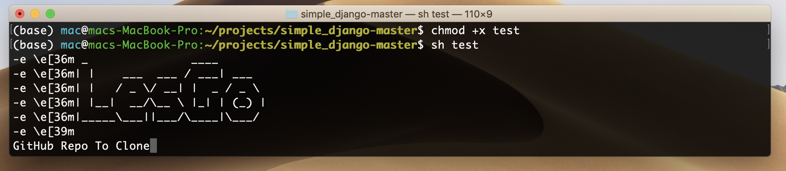

Django Auto Deployment for CentOS 7  

Python 3.7 + PostgreSQL+ Nginx + CentOS 7 + Gunicorn + Supervisor + Django 2/3

---------


```
wget https://raw.githubusercontent.com/tokyodevs/simple_django/master/lesgo.sh
chmod +x lesgo.sh
sh lesgo.sh
```


<p align="center"></p>
